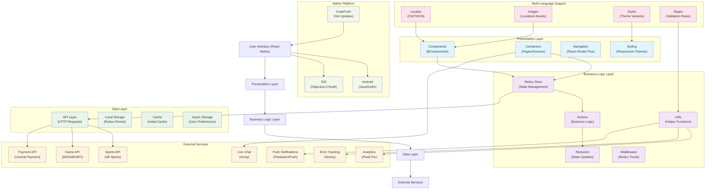

# F1-APP-ST

## 📱 F1 Sports Betting Mobile Application

A multi-language React Native application for sports betting and gaming, supporting Chinese (CN), Thai (TH), and Vietnamese (VN) markets.

## 🏗️ Architecture Overview



## 🏛️ Detailed ASCII Architecture

### Overall System Architecture

```
┌─────────────────────────────────────────────────────────────────┐
│                    F1 Sports Betting App                       │
│                     (React Native)                             │
└─────────────────────┬───────────────────────────────────────────┘
                      │
┌─────────────────────▼───────────────────────────────────────────┐
│                  PRESENTATION LAYER                            │
│  ┌─────────────┐  ┌─────────────┐  ┌─────────────┐  ┌─────────┐│
│  │ Components  │  │ Containers  │  │ Navigation  │  │ Styling ││
│  │ (Reusable)  │  │ (Screens)   │  │ (RN Router) │  │ (Themes)││
│  └─────────────┘  └─────────────┘  └─────────────┘  └─────────┘│
└─────────────────────┬───────────────────────────────────────────┘
                      │
┌─────────────────────▼───────────────────────────────────────────┐
│                 BUSINESS LOGIC LAYER                           │
│  ┌─────────────┐  ┌─────────────┐  ┌─────────────┐  ┌─────────┐│
│  │Redux Store  │  │ Actions     │  │ Reducers    │  │ Utils   ││
│  │(State Mgmt) │  │(Logic/API)  │  │(State Upd.) │  │(Helpers)││
│  └─────────────┘  └─────────────┘  └─────────────┘  └─────────┘│
└─────────────────────┬───────────────────────────────────────────┘
                      │
┌─────────────────────▼───────────────────────────────────────────┐
│                    DATA LAYER                                  │
│  ┌─────────────┐  ┌─────────────┐  ┌─────────────┐  ┌─────────┐│
│  │ API Layer   │  │Local Storage│  │ Cache       │  │AsyncStg ││
│  │(HTTP Reqs)  │  │(Redux Pers.)│  │(Init Data)  │  │(User Pr)││
│  └─────────────┘  └─────────────┘  └─────────────┘  └─────────┘│
└─────────────────────┬───────────────────────────────────────────┘
                      │
┌─────────────────────▼───────────────────────────────────────────┐
│                 EXTERNAL SERVICES                              │
│  ┌──────────┐ ┌──────────┐ ┌──────────┐ ┌──────────┐ ┌───────┐│
│  │SB Sports │ │Game APIs │ │Payment   │ │Analytics │ │ Chat  ││
│  │(Betting) │ │(IM/SABA) │ │(Central) │ │(Piwik)   │ │(Amity)││
│  └──────────┘ └──────────┘ └──────────┘ └──────────┘ └───────┘│
└─────────────────────────────────────────────────────────────────┘
```

### Multi-Language Architecture (I18n)

```
┌─────────────────────────────────────────────────────────────────┐
│                   LOCALIZATION SYSTEM                          │
│                                                                 │
│  ┌─────────────┐    ┌─────────────┐    ┌─────────────┐         │
│  │     CN      │    │     TH      │    │     VN      │         │
│  │  (Chinese)  │    │   (Thai)    │    │(Vietnamese) │         │
│  └─────────────┘    └─────────────┘    └─────────────┘         │
│         │                   │                   │              │
│  ┌──────▼──────┐    ┌────────▼───────┐ ┌────────▼───────┐      │
│  │ Translations│    │ Localized      │ │ Regional       │      │
│  │ (Text/UI)   │    │ Images/Assets  │ │ Styles/Themes  │      │
│  └─────────────┘    └────────────────┘ └────────────────┘      │
│         │                   │                   │              │
│  ┌──────▼──────┐    ┌────────▼───────┐ ┌────────▼───────┐      │
│  │ Validation  │    │ Date/Number    │ │ Currency       │      │
│  │ Regex Rules │    │ Formatting     │ │ Formatting     │      │
│  └─────────────┘    └────────────────┘ └────────────────┘      │
└─────────────────────────────────────────────────────────────────┘
```

### File Structure Deep Dive

```
F1-APP-CODE/
├── 📱 src/                           # Main source code
│   ├── 🔧 actions/                   # API calls & business logic
│   │   ├── Api.js                    # Core API configurations
│   │   ├── Api.json                  # API endpoint definitions
│   │   ├── CmsApi.js                 # Content management API
│   │   └── [Other API modules]       # Feature-specific APIs
│   │
│   ├── 🎨 components/                # Reusable UI components
│   │   ├── BettingCalendar.js        # Shared calendar component
│   │   ├── Button.js                 # Custom button component
│   │   ├── 🎯 icons/                 # Icon components library
│   │   │   ├── svg/                  # SVG icon sources
│   │   │   └── [Icon components]     # React Native icon wrappers
│   │   ├── 🪟 Modals/                # Modal components
│   │   ├── 🧭 Nav/                   # Navigation components
│   │   └── 🚀 SplashScreen/          # App launch components
│   │
│   ├── 📱 containers/                # Screen/Page components
│   │   ├── 🏦 Bank/                  # Banking & payments
│   │   │   ├── DepositCenter.js      # Deposit management
│   │   │   ├── BankCard.js           # Bank card UI
│   │   │   └── CentralPayment/       # Payment processing
│   │   ├── 📊 BettingRecord/         # Betting history
│   │   ├── 🎮 Game/                  # Game-related screens
│   │   │   ├── AviatorGame/          # Aviator game specific
│   │   │   ├── ProductGamePage/      # Game lobby
│   │   │   └── ProductIntro/         # Game introductions
│   │   ├── 🏠 Home/                  # Home screen components
│   │   ├── 👤 Profile/               # User profile & settings
│   │   │   ├── AboutUSDT/            # USDT information
│   │   │   ├── UserInfo/             # User information
│   │   │   ├── VIP/                  # VIP system
│   │   │   └── UploadFile/           # Document upload
│   │   ├── 🔐 Login/                 # Authentication screens
│   │   ├── 💬 LiveChat/              # Customer support chat
│   │   └── ⚽ SbSportsCN/SbSportsVN/ # Sports betting (localized)
│   │
│   ├── 🖼️ images/                    # Image assets (organized by feature)
│   │   ├── home/                     # Home screen images
│   │   │   ├── CN/                   # Chinese market assets
│   │   │   ├── TH/                   # Thai market assets
│   │   │   └── VN/                   # Vietnamese market assets
│   │   ├── user/                     # User profile images
│   │   ├── game/                     # Gaming related images
│   │   └── promotion/                # Promotional banners
│   │
│   ├── 📚 lib/                       # Core utilities & Redux
│   │   ├── 🔄 redux/                 # State management
│   │   │   ├── actions/              # Redux action creators
│   │   │   ├── reducers/             # Redux reducers
│   │   │   ├── store/                # Store configuration
│   │   │   └── store.js              # Main store setup
│   │   ├── 🛠️ utils/                 # Helper functions
│   │   └── 🌐 data/                  # Static data & configurations
│   │
│   └── 🌍 locales/                   # Internationalization
│       ├── Images.js                 # Localized image mappings
│       ├── ImagesModule/             # Feature-specific image maps
│       ├── Styles.js                 # Localized style mappings
│       ├── styles/                   # Platform-specific styles
│       ├── Reg.js                    # Validation regex patterns
│       └── [Translation files]       # Text translations
│
├── 🤖 android/                       # Android native code
│   ├── app/                          # Main Android application
│   │   ├── libs/                     # Native libraries
│   │   │   ├── eagleeyes-release.aar # Fraud detection
│   │   │   ├── fraudforce-lib.aar    # Security library
│   │   │   └── tinstall.aar          # Install tracking
│   │   └── src/                      # Java/Kotlin source
│   └── gradle/                       # Build configuration
│
├── 🍎 ios/                           # iOS native code
│   ├── FedevProject/                 # Main iOS project
│   │   ├── Eagleeyes/                # iOS fraud detection
│   │   ├── TInstall/                 # iOS install tracking
│   │   ├── UMComponents/             # Umeng SDK components
│   │   └── UMReactBridge/            # React Native bridges
│   ├── fonts/                        # Custom fonts
│   └── Pods/                         # CocoaPods dependencies
│
└── 🔧 patches/                       # NPM package modifications
    ├── @gpsgate+react-native...      # EventSource patch
    ├── @piwikpro+react-native...     # Analytics patch
    └── [Other patches]               # Various library fixes
```

## 🎯 新手入門指南 (Getting Started Guide)

### 🚨 重要注意事項 (Critical Notes)

#### 1. 🌐 多語言系統 (Multi-language System)

```javascript
// ❌ 錯誤 - 直接硬編碼文字
<Text>登入</Text>

// ✅ 正確 - 使用翻譯系統
import { translate } from "$locales/translate";
<Text>{translate("登入")}</Text>

// ✅ 帶參數的翻譯
<Text>{translate("您還有 {X} 次嘗試機會", { X: attempts })}</Text>
```

#### 2. 🎨 樣式系統 (Styling System)

```javascript
// ❌ 錯誤 - 硬編碼顏色
<Text style={{ color: "#FF0000" }}>錯誤訊息</Text>;

// ✅ 正確 - 使用本地化樣式
import StyleMap from "$locales/Styles";
<Text style={StyleMap.errorText}>錯誤訊息</Text>;
```

#### 3. 🖼️ 圖片系統 (Image System)

```javascript
// ❌ 錯誤 - 直接引用圖片
<Image source={require("../images/logo.png")} />;

// ✅ 正確 - 使用本地化圖片
import ImgMap from "$locales/Images";
<Image source={ImgMap.loginLogo} />;
```

#### 4. 🔄 Redux 狀態管理 (State Management)

```javascript
// ❌ 錯誤 - 直接使用 react-redux
import { useSelector, useDispatch } from "react-redux";

// ✅ 正確 - 使用專案自定義 hooks
import { useAppSelector, useAppDispatch } from "@/store/hooks";
```

### 📋 開發檢查清單 (Development Checklist)

#### 🏗️ 新功能開發前 (Before Starting New Features)

- [ ] 確認目標語言市場 (CN/TH/VN)
- [ ] 檢查是否需要本地化資源
- [ ] 確認 UI/UX 設計適應性
- [ ] 檢查相關 API 文檔
- [ ] 確認 Redux store 結構

#### 🧪 開發過程中 (During Development)

- [ ] 使用正確的翻譯系統
- [ ] 遵循本地化樣式規範
- [ ] 實現適當的錯誤處理
- [ ] 添加載入狀態指示器
- [ ] 確保 Redux actions 型別安全
- [ ] 測試不同語言環境

#### ✅ 提交前檢查 (Pre-commit Checklist)

- [ ] 移除 console.log 調試代碼
- [ ] 確保沒有硬編碼文字/顏色
- [ ] 檢查所有語言環境正常顯示
- [ ] 測試網路異常處理
- [ ] 驗證表單輸入驗證
- [ ] 確認安全性最佳實踐

### 🗂️ 重要文件夾說明 (Important Directories)

#### 📡 `/src/actions/` - API 與業務邏輯

- `Api.js` - 核心 API 配置和攔截器
- `Api.json` - API 端點和配置定義
- `CmsApi.js` - 內容管理系統 API
- 各功能模塊的 API 調用邏輯

#### 🏗️ `/src/containers/` - 頁面組件

- 每個子資料夾代表一個功能模塊
- 包含完整的頁面邏輯和狀態管理
- 負責連接 Redux store 和 UI 組件

#### 🌍 `/src/locales/` - 國際化配置

```
locales/
├── Images.js          # 圖片本地化映射
├── ImagesModule/      # 功能模塊圖片映射
├── Styles.js          # 樣式本地化映射
├── styles/            # 各語言特定樣式
│   ├── cn.js         # 中文樣式配置
│   ├── th.js         # 泰文樣式配置
│   └── vn.js         # 越文樣式配置
├── Reg.js            # 各語言驗證規則
└── translate.js      # 翻譯功能核心
```

### 🔧 開發工具配置 (Development Tools)

#### Babel 路徑別名 (Path Aliases)

```javascript
// babel.config.js 中已配置的別名
"$actions"     → "src/actions"
"$components"  → "src/components"
"$containers"  → "src/containers"
"$images"      → "src/images"
"$lib"         → "src/lib"
"$locales"     → "src/locales"
"$utils"       → "src/lib/utils"
"$redux"       → "src/lib/redux"
```

#### 常用導入範例 (Common Imports)

```javascript
// API 調用
import { loginApi, getUserInfo } from "$actions/UserApi";

// UI 組件
import CustomButton from "$components/Button";

// 工具函數
import { formatCurrency } from "$utils/formatters";

// Redux
import { useAppSelector, useAppDispatch } from "$redux/hooks";

// 本地化
import { translate } from "$locales/translate";
import StyleMap from "$locales/Styles";
import ImgMap from "$locales/Images";
```

### ⚠️ 常見陷阱與解決方案 (Common Pitfalls)

#### 1. 語言切換問題

```javascript
// 問題：組件不會重新渲染
// 解決：確保語言變更時強制更新
useEffect(() => {
    // 語言變更監聽邏輯
}, [currentLanguage]);
```

#### 2. 圖片資源載入失敗

```javascript
// 問題：本地化圖片路徑錯誤
// 解決：使用 ImgMap 統一管理
const getLocalizedImage = imageName => {
    return ImgMap[imageName] || defaultImage;
};
```

#### 3. API 請求錯誤處理

```javascript
// 問題：沒有統一的錯誤處理
// 解決：使用 API 攔截器統一處理
// 參考 src/actions/Api.js 的實現
```

### 🚀 推薦開發流程 (Recommended Workflow)

1. **需求分析** → 確認功能需求和設計
2. **架構設計** → 規劃 Redux state 和 API 結構
3. **UI 開發** → 先開發單一語言版本
4. **本地化** → 添加多語言支持
5. **測試** → 測試各語言環境和邊界情況
6. **優化** → 性能優化和代碼重構
7. **提交** → 代碼審查和部署

## 🌐 Multi-Language Support

### 默认设置

- window.LANGUAGE='CN'//CN/TH/VN
- SetDefaultConfig('CN')//CN/TH/VN

### 翻译

```jsx
import { translate } from "$locales/translate";
translate("您还有 {X} 次尝试机会", { X: 8 }); //X占位符
```

### style

- src/locales/styles文件，cn/th/vn对应不同平台style，有差异的style

```jsx
import StyleMap from "$locales/Styles";
<Text style={StyleMap.colors}>颜色</Text>;
```

### image

- 有差异的image

```jsx
import ImgMap from "$locales/Images";
<Image resizeMode="stretch" source={ImgMap.loginLogo} />;
```

### 正则

```jsx
import { nameReg } from "$locales/Reg";
nameReg.test("userName");
```

## 🔧 Core Technologies

### Frontend Framework

- **React Native 0.70.9** - Cross-platform mobile development
- **React 18.1.0** - UI library

### State Management

- **Redux 4.2.1** - Application state management
- **Redux Persist 6.0.0** - State persistence
- **Redux Thunk 2.4.2** - Async action handling

### Navigation

- **React Native Router Flux 4.3.1** - Navigation management

### Development Tools

- **CodePush** - Hot updates and deployments
- **Babel** - JavaScript transpilation with custom aliases
- **ESLint** - Code linting and formatting

### External Integrations

- **Piwik Pro SDK** - Analytics and tracking
- **Sentry** - Error monitoring and crash reporting
- **Firebase** - Push notifications and analytics
- **Amity Chat** - Live chat functionality

### Payment Processing

- **Central Payment** - Multi-method payment processing
- Support for various regional payment methods

### Sports Betting

- **SB Sports** - Sports betting platform integration
- **IM/SABA/BTI** - Multiple gaming vendors

## 🛠️ Development Setup

### Prerequisites

- Node.js >= 14
- React Native CLI
- Xcode (for iOS development)
- Android Studio (for Android development)

## 📱 Features

- **Multi-language Support**: CN, TH, VN
- **Sports Betting**: Live and pre-match betting
- **Gaming**: Multiple gaming vendors integration
- **Payment**: Secure payment processing
- **Live Chat**: Customer support integration
- **Push Notifications**: Real-time updates
- **Biometric Authentication**: Touch/Face ID support
- **Offline Support**: Redux persist for offline functionality

## 🔐 Security Features

- **Biometric Authentication** (Touch ID/Face ID)
- **Gesture Password** support
- **SEON Fraud Detection** integration
- **Secure Token Management**
- **SSL Certificate Pinning**


## 🛠 開發指令

## 📦 NPM 指令

### Installation

```bash
# Install dependencies
npm install --legacy-peer-deps

# 如果遇到安裝問題可嘗試清除 node_modules 後重裝
rm -rf node_modules && npm install --legacy-peer-deps

# iOS setup
cd ios && pod install && cd ..

# Android setup (if needed)
cd android && ./android/gradlew clean -p android

# Android pack
cd android && ./gradlew assembleRelease

# Start Metro bundler
npm start

# Run on iOS
npm run ios

# Run on Android
npm run android
```

### 清緩存和重新安裝
```bash
# 清 npm 緩存
npm cache clean --force

# 清 yarn 緩存
yarn cache clean

# 清 Metro 緩存
npx react-native start --reset-cache

# 清 Watchman 緩存
watchman watch-del-all

# 完全重新安裝 (推薦)
rm -rf node_modules && npm install --legacy-peer-deps
rm -rf node_modules && yarn install --ignore-engines

# 清緩存並重新安裝
npm cache clean --force && rm -rf node_modules && npm install --legacy-peer-deps
yarn cache clean && rm -rf node_modules && yarn install --ignore-engines
```

### 開發指令
```bash
# 啟動 Metro 開發伺服器
npm start
yarn start

# 啟動並清緩存
npm start -- --reset-cache
yarn start --reset-cache

# 執行測試
npm test
yarn test

# 程式碼檢查
npm run lint
yarn lint

# 修復程式碼格式
npx eslint . --fix
```

### 打包指令
```bash
# 生成 Android Bundle
npx react-native bundle --platform android --dev false --entry-file index.js --bundle-output android/app/src/main/assets/index.android.bundle --assets-dest android/app/src/main/res

# 生成 iOS Bundle
npx react-native bundle --platform ios --dev false --entry-file index.js --bundle-output ios/main.jsbundle --assets-dest ios

# 執行打包腳本
node build_ios_zip.js
```

## 🔧 Git 指令

### 基本操作
```bash
# 查看狀態
git status

# 查看分支
git branch -a

# 切換分支
git checkout <branch-name>
git checkout -b <new-branch-name>

# 提交變更
git add .
git commit -m "feat: add new feature"

# 推送到遠端
git push origin <branch-name>

# 拉取最新變更
git pull origin <branch-name>
```

### 版本管理
```bash
# 查看提交歷史
git log --oneline

# 查看檔案變更
git diff

# 重置到特定提交
git reset --hard <commit-hash>

# 合併分支
git merge <branch-name>

# 強制推送 (謹慎使用)
git push --force-with-lease origin <branch-name>
```

### 標籤管理
```bash
# 創建標籤
git tag v1.0.0

# 推送標籤
git push origin v1.0.0

# 查看所有標籤
git tag -l

# 刪除標籤
git tag -d v1.0.0
git push origin --delete v1.0.0
```

### 清理和重置
```bash
# 清理未追蹤檔案
git clean -fd

# 重置所有變更
git reset --hard HEAD

# 重置到遠端分支
git reset --hard origin/<branch-name>
```

## 📱 iOS 指令

### 開發環境
```bash
# 安裝 iOS 依賴
cd ios && pod install

# 啟動 iOS 模擬器
npm run ios
yarn ios

# 指定模擬器
npx react-native run-ios --simulator="iPhone 14"

# 清理建置
cd ios && xcodebuild clean
```

### 清緩存和重新安裝
```bash
# 清 CocoaPods 緩存
cd ios && pod cache clean --all

# 清 Xcode 緩存
rm -rf ~/Library/Developer/Xcode/DerivedData
rm -rf ~/Library/Caches/com.apple.dt.Xcode

# 重新安裝 Pods
cd ios && rm -rf Pods && rm -rf Podfile.lock && pod install

# 完全清理並重新安裝
cd ios && rm -rf Pods && rm -rf Podfile.lock && pod cache clean --all && pod install
```

### 建置和部署
```bash
# 建置 Release 版本
cd ios && xcodebuild -workspace FedevProject.xcworkspace -scheme FedevProject -configuration Release -destination generic/platform=iOS archive -archivePath FedevProject.xcarchive

# 匯出 IPA
xcodebuild -exportArchive -archivePath FedevProject.xcarchive -exportOptionsPlist exportOptions.plist -exportPath ./build

# 執行自動化腳本
node build_ios_zip.js

# 建置並安裝到設備
cd ios && xcodebuild -workspace FedevProject.xcworkspace -scheme FedevProject -configuration Debug -destination 'platform=iOS Simulator,name=iPhone 14' build
```

## 🤖 Android 指令

### 開發環境
```bash
# 啟動 Android 模擬器
npm run android
yarn android

# 指定設備
npx react-native run-android --deviceId <device-id>

# 清理建置
cd android && ./gradlew clean
```

### 清緩存和重新安裝
```bash
# 清 Gradle 緩存
cd android && ./gradlew clean
rm -rf ~/.gradle/caches/

# 清 Android 建置緩存
cd android && rm -rf app/build
cd android && rm -rf .gradle

# 重新同步 Gradle
cd android && ./gradlew --refresh-dependencies

# 完全清理並重新建置
cd android && ./gradlew clean && rm -rf .gradle && ./gradlew build
```

### 建置和部署
```bash
# 建置 Debug APK
cd android && ./gradlew assembleDebug

# 建置 Release APK
cd android && ./gradlew assembleRelease

# 建置 Release AAB
cd android && ./gradlew bundleRelease

# 簽署 APK
cd android && ./gradlew assembleRelease -Pandroid.injected.signing.store.file=<keystore-path> -Pandroid.injected.signing.store.password=<password> -Pandroid.injected.signing.key.alias=<alias> -Pandroid.injected.signing.key.password=<password>

# 安裝到設備
cd android && ./gradlew installDebug
cd android && ./gradlew installRelease
```

### 設備管理
```bash
# 列出連接的設備
adb devices

# 重啟 ADB 服務
adb kill-server && adb start-server

# 安裝 APK
adb install app-debug.apk

# 卸載應用
adb uninstall com.fedevproject
```

## 🔄 故障排除指令

### 常見問題解決
```bash
# 1. 依賴問題 - 完全重新安裝
rm -rf node_modules && npm install --legacy-peer-deps

# 2. iOS 問題 - 清理並重新安裝 Pods
cd ios && rm -rf Pods && rm -rf Podfile.lock && pod install

# 3. Android 問題 - 清理並重新建置
cd android && ./gradlew clean && ./gradlew build

# 4. Metro 問題 - 清緩存重啟
npx react-native start --reset-cache

# 5. 完整重置 (最後手段)
rm -rf node_modules && npm install --legacy-peer-deps && cd ios && rm -rf Pods && pod install && cd ../android && ./gradlew clean
```